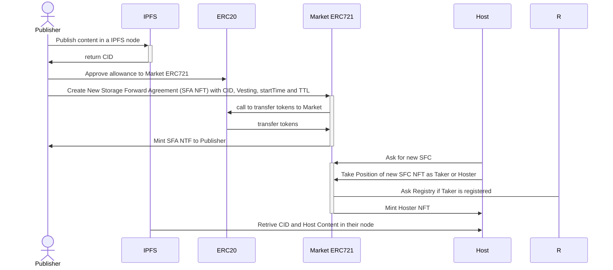
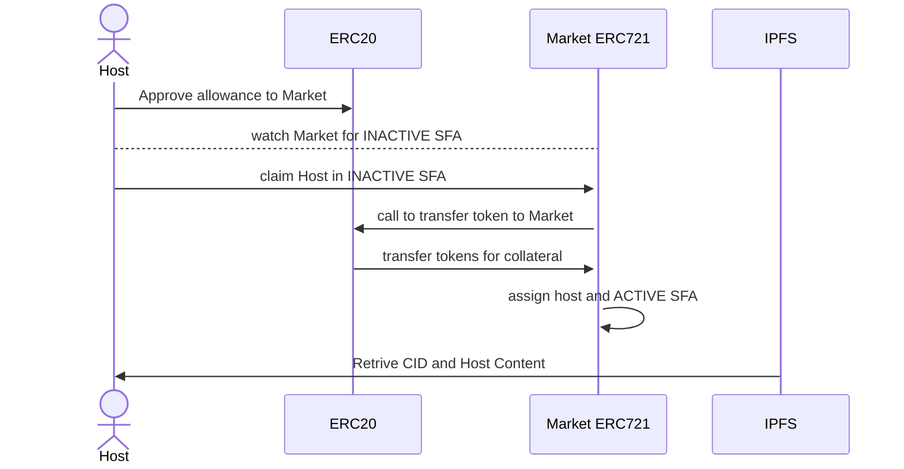
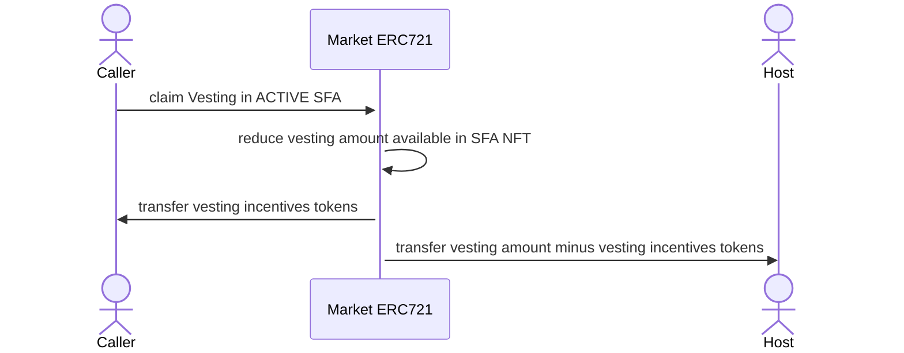
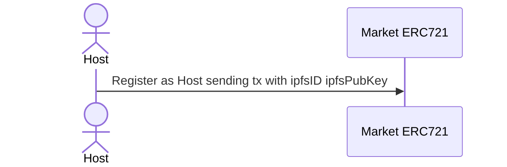
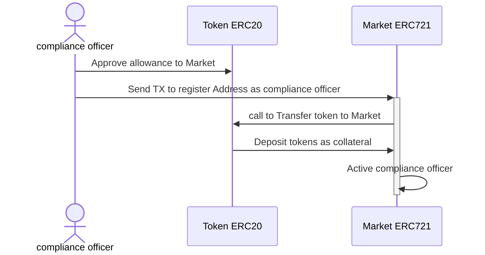
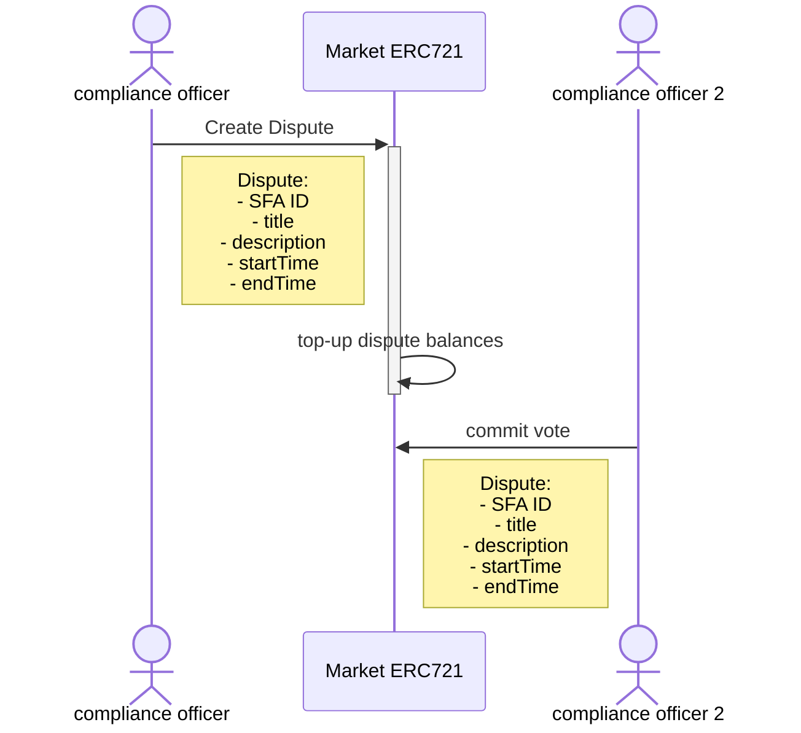

# SFA Market:

**Transforming Decentralized Storage with Storage Forward Agreements**

_NOTE: This document is a work in progress. Please check back regularly for updates!_

### To Do:

- [ ] explain ecosystem and their entities
- [ ] add info about compliance officer
- [ ] add info about disputes
- [ ] add info about random arbitrators

## Table of Contents

- [Abstract](#Abstract)
- [Introduction](#Introduction)
- [Problem / Challenge](#Problem--Challenge)
- [Proposed Solution](#Proposed-Solution)
- [Background / State of the Art](#Background--State-of-the-Art)

# Abstract

Decentralized storage faces significant challenges in terms of incentives and reliability, limiting its widespread adoption. SFA Market introduces Storage Forward Agreements (SFAs), an innovative solution in the crypto ecosystem that allows content publishers to ensure the availability of their data through a one-time payment, guaranteeing its storage for a defined period. Unlike the monthly subscription model of Web2, SFAs offer stability and predictability, better aligning incentives for publishers and hosts. Hosts must make a collateral deposit, which is refundable upon fulfilling the agreement, and can be penalized in case of non-compliance, ensuring the system's integrity. Additionally, SFAs allow for the transfer of responsibilities in a secondary market, providing flexibility, liquidity, and efficiency in decentralized storage. This innovative approach offers a robust and flexible solution to the current incentive challenges of data storage in the Web3 era.

# Introduction

Decentralized data storage has gained significant attention due to its ability to offer greater privacy, security, and control over data compared to traditional centralized solutions. Despite its benefits, the widespread adoption of decentralized storage technologies faces significant challenges, particularly in creating a robust incentive system that is fair for both publishers and storage providers.

In the Web2 model, incentives are primarily focused on storage usage or bandwidth, benefiting large corporations that can offer services on a large scale. This model does not adapt well to a decentralized environment, where infrastructure is distributed among many small providers. Additionally, transparency and verification of storage and bandwidth usage are challenging to implement and maintain in a truly decentralized system.

SFA Market proposes an innovative solution that redefines incentives in decentralized storage. Through Storage Forward Agreements (SFAs), content publishers can create agreements in open and transparent markets where hosts can choose to take on this responsibility. This ensures that their data will be available in the system for a defined period, eliminating the need for monthly subscriptions. This document details how SFA Market works to align incentives, improve the reliability and efficiency of storage, and facilitate the adoption of decentralized storage technologies.

# Problem / Challenge

Decentralized storage systems, such as IPFS, Filecoin, Storj, and Sia, have established the groundwork for distributed data storage. However, they face significant challenges:

1. **Incentive Misalignment**: Current models primarily focus on storage and bandwidth usage, benefiting large-scale providers and creating an unsustainable and inequitable environment for smaller providers.
2. **Verification and Validation**: Ensuring transparency and reliability in verifying storage and bandwidth usage is complex and impacts system efficiency.
3. **Sustainability**: The reliance on continuous incentives (like tokens) for storage providers can lead to fluctuations and unpredictability, affecting long-term data availability.
4. **Complex Agreements**: Existing platforms often have predefined terms that lack flexibility, limiting the ability of publishers and storage providers to customize agreements based on specific needs.

# Proposed Solution

SFA Market addresses these challenges by introducing Storage Forward Agreements (SFAs), which offer several key innovations:

1. **One-Time Payment Model**: SFAs allow content publishers to ensure the availability of their data through a one-time payment, guaranteeing storage of a specific data for a defined period and eliminating the need for monthly subscriptions and contracted idle storage.
2. **Collateral Deposits**: Hosts must make a collateral deposit, which ensures compliance with the agreement. If a host fails to meet their obligations, they are penalized, and the collateral is refunded to the publisher, ensuring system integrity.
3. **Transferable Agreements**: SFAs are essentially NFTs that can be transferred between parties. This allows both publishers and storage providers to sell or transfer their rights and obligations, creating a secondary market that enhances liquidity and efficiency.
4. **Customization**: SFAs offer flexibility in defining terms such as TTL (time-to-live), pricing, and collateral requirements, allowing for tailored agreements that better meet the needs of both parties.
5. **Open Ecosystem**: SFA Market is built on cypherpunk principles, aiming to create open tools that are compatible and connectable with other ecosystem tools, providing greater freedom and interoperability.
   **Compliance Officers:** Independent entities or nodes responsible for monitoring compliance with SFA terms, ensuring data integrity, and initiating penalties for non-compliance.
   **Dispute Resolution and Arbitrators:** In case of disputes, the system utilizes random arbitrators to ensure unbiased resolution. These arbitrators are selected from a pool of verified nodes, ensuring fair and transparent dispute handling.

# Background / State of the Art

Decentralized storage has seen remarkable growth with the introduction of technologies such as IPFS (InterPlanetary File System), Filecoin, Swarm Ethereum, Storj, among others. These platforms have established a solid foundation for distributed data storage, offering alternatives to traditional centralized solutions.

**IPFS**: is a protocol and network designed to create a peer-to-peer method of storing and sharing hypermedia in a distributed file system.

**Filecoin**: is a decentralized storage network that turns cloud storage into an algorithmic market.

**Storj**: is a decentralized cloud storage platform that uses encryption and file fragmentation.

**Sia**: is a decentralized cloud storage platform that uses smart contracts to ensure data integrity and availability.

**SWARM**: is a distributed storage platform and content distribution service native to Ethereum, designed to serve as a decentralized storage system.

Despite these advancements, significant limitations persist. Current incentive models often focus on storage and bandwidth usage, which may not be completely sustainable or equitable in a distributed environment. Additionally, verifying and validating storage can be complicated, impacting the system's reliability and efficiency.

SFA Market aims to overcome these limitations by introducing Storage Forward Agreements (SFAs). These agreements are essentially NFTs that are introduced into our smart contract, allowing content publishers to create offers to store files through a one-time payment, ensuring their data will be available for a defined period. Hosts can claim to store the content in exchange for a collateral deposit, ensuring compliance with the agreement and providing a more secure and efficient solution for decentralized storage.

A similar case with nuanced qualities could be Sia, which allows publishers to upload files that will be maintained for a predetermined time defined by its blockchain, currently three months. Meanwhile, Sia presents an all-in-one platform where they provide their own blockchain, wallet, host, and the terms of agreements seem predefined, SFA Market is more focused on cypherpunk principles, we are decided to build open tools that can be compatible and connectable with ecosystem tools also giving some freedom on qualities like TTL (time-to-live), pricing, collateral required and re-sell market (secondary market).

SFAs add a new instrument to the EVM and a new form of free agreements between parties, allowing both publishers and storage providers to agree on the price of storing a content. Each NFT will have two transferable properties: the publisher and the storage provider (host), allowing users to transfer the obligation of storage or sell the publisher's right to the content. This creates the possibility of a secondary market where storage costs can fluctuate freely based on agreements, not necessarily tied to the tokens used as rewards and collateral.

# Ecosystem and Their Entities

## Content Publishers

These are the entities or individuals who need their data to be stored. They create SFAs making a one-time payment to ensure the availability of their data for a specified period of time.

## Storage Hosts

These are the entities or individuals who provide the storage space. They claim to be the hosts of the SFA and make collateral deposits to guarantee compliance with the terms of the agreement.

## Compliance Officers

Independent entities or nodes responsible for monitoring compliance with SFA terms. They ensure that storage hosts are fulfilling their obligations and that data integrity is maintained by persisting a local log. Compliance Officers initiate disputes to penalize for non-compliance, adding an extra layer of security and reliability to the system.

## Arbitrators

In case a dispute is initiated, arbitrators are randomly selected. They ensure unbiased resolution and handle disputes fairly and transparently by requesting logs from compliance officers.

## Technical Details

The implementation of Storage Forward Agreements (SFAs) is based on:

- **SFA Market:** SFAs are implemented in a smart contracts called SFAMarket on the blockchain. These smart contracts manage the creation, transfer, and settlement of storage agreements, like also creation of disputes, manage of balances, rewards and penalizations.

- **NFTs (Non-Fungible Tokens):** Each SFA is represented as a unique NFT, which contains metadata about the agreement, such as the time-to-live (TTL), Content ID, collateral deposit, vesting amount deposited, vesting amount claimed, and host.

- **Compliance Officers:** Independent entities that monitor compliance with SFA. They use verification algorithms to ensure CIDs are correctly stored and that hosts fulfill their obligations. Any user can setup an Compliance Officer node. CO Nodes can initialize disputes over some SFA if any term is not being met.

- **Arbitratorss:** Indepent entities that are choosed randomly when a dipute is open. Arbitrators should vote or they will be penalizated. Arbitrators commit hashed vote. When vote time is end, Arbitrator should revel vote decition and salt used to hash their commit vote.

- **User Interface (UI):** A WebApp that allows users (content publishers and hosts) to interact with the system, create SFAs, manage collateral deposits, and monitor the status of their agreements.

### SFA Creation

### Host claim position in open SFA

### Claim Vesting in SFA

call for available vesting in SFA NFT is open to public in base of incentives to caller, so in this way we can incentive market to automate and keep token rolling.
caller get a ratio participation of vesting amount tranfered

### Register as Host

#### Register as compliance officer

## Create a Dispute

When a host is not working as expected or the CID is not available, compliance officers can create a dispute to charge a penalty to hosts of SFA that are not complying with their obligations.

