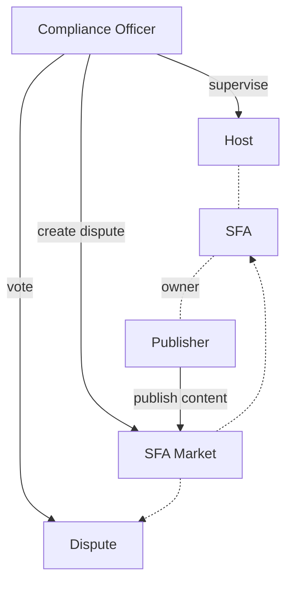
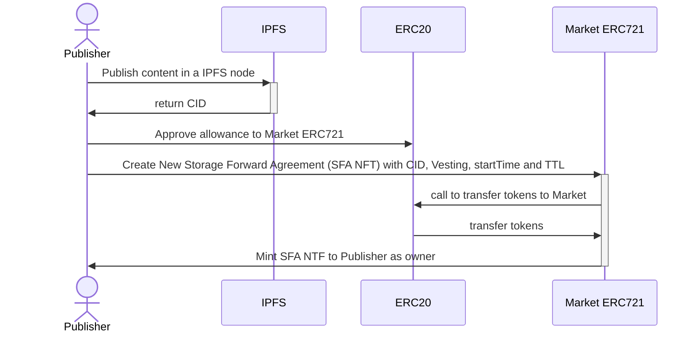
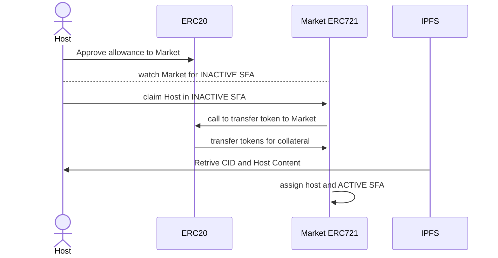
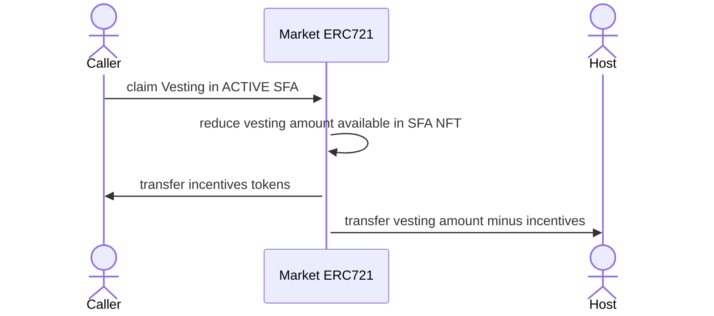
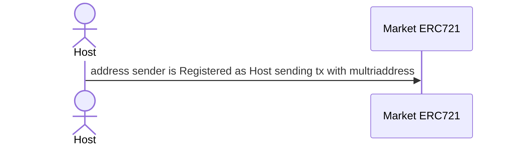
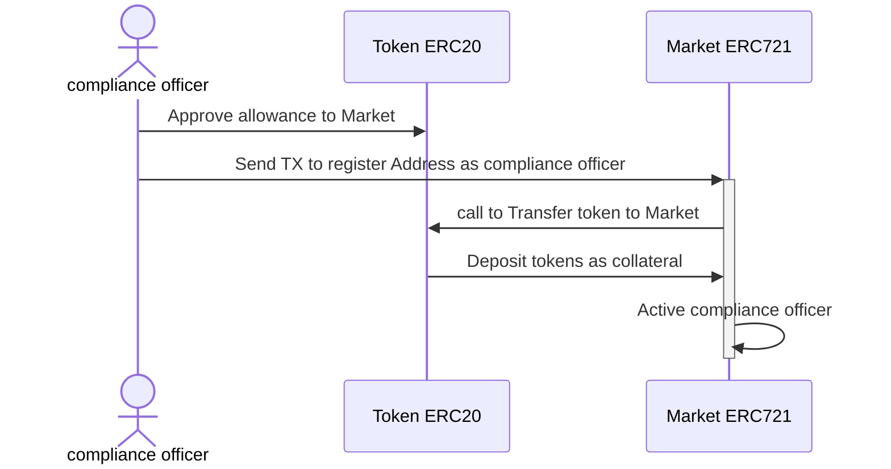
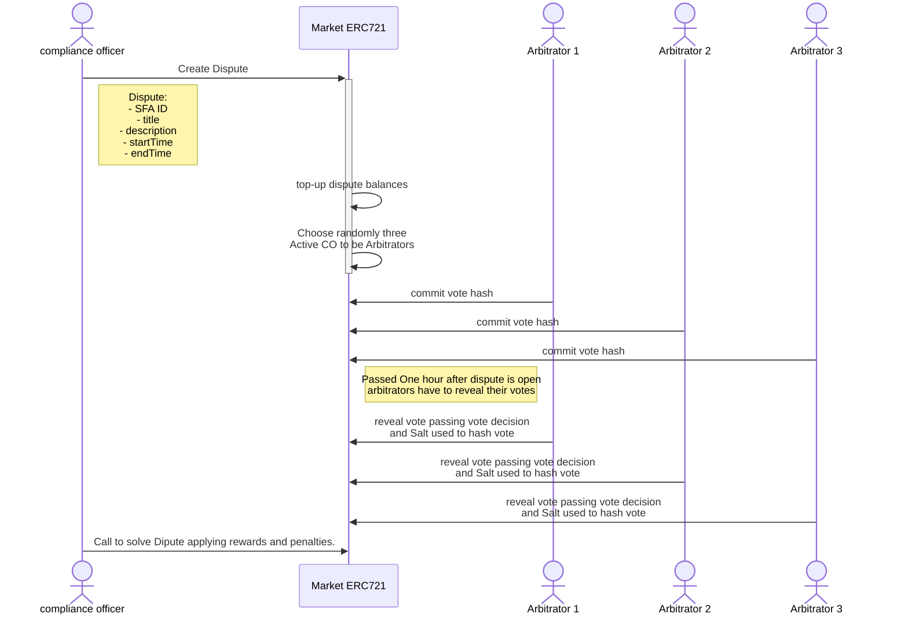

# SFA Market:

**Transforming Decentralized Storage with Storage Forward Agreements**

_NOTE: This document is a work in progress. Please check back regularly for updates!_

## Table of Contents

- [Abstract](#abstract)
- [Introduction](#introduction)
- [Problem / Challenge](#problem--challenge)
- [Proposed Solution](#proposed-solution)
- [Background / State of the Art](#background--state-of-the-art)
- [Ecosystem and Their Entities](#ecosystem-and-their-entities)
- [Use cases](#use-cases)
- [Token Economic](#token-economic)

# Abstract

An innovative protocol solution in the crypto ecosystem that allows content publishers to ensure the availability of their data for a defined period through a one-time payment. Decentralized storage faces significant challenges in terms of incentives and reliability, limiting its widespread adoption. Unlike the monthly subscription model of Web2, SFAs offer stability and predictability, better aligning incentives for publishers and hosts. Hosts make a collateral deposit, which is refundable upon fulfilling the agreement, and can be penalized in case of non-compliance, ensuring the system's integrity. Additionally, SFAs allow for the transfer of responsibilities in a secondary market, providing flexibility, liquidity, and efficiency in decentralized storage. This innovative approach offers a robust and flexible tool solution to the current incentive challenges of data storage in the Web3 era.

# Introduction

Decentralized data storage has gained significant attention due to its ability to offer greater privacy, security, and control over data compared to traditional centralized solutions. Despite its benefits, the widespread adoption of decentralized storage technologies faces significant challenges, particularly in creating a robust incentive system that is fair for both publishers and storage providers.

In the Web2 model, incentives are primarily focused on storage usage or bandwidth, benefiting large corporations that can offer services on a large scale. This model does not adapt well to a decentralized environment, where infrastructure is distributed among many small providers. Additionally, transparency and verification of storage and bandwidth usage are challenging to implement and maintain in a truly decentralized system.

SFA Market proposes an innovative solution that redefines incentives in decentralized storage. Through Storage Forward Agreements (SFAs), content publishers can create agreements in open and transparent markets where hosts can choose to take on this responsibility. This ensures that their data will be available in the system for a defined period, eliminating the need for monthly subscriptions. This document details how SFA Market works to align incentives, improve the reliability and efficiency of storage, and facilitate the adoption of decentralized storage technologies.

# Problem / Challenge

Decentralized storage systems, such as IPFS, Filecoin, Storj, and Sia, have established the groundwork for distributed data storage. However, they face significant challenges:

1. **Incentive Misalignment**: Current models primarily focus on storage and bandwidth usage, benefiting large-scale providers and creating an unsustainable and inequitable environment for smaller providers.
2. **Verification and Validation**: Ensuring transparency and reliability in verifying storage and bandwidth usage is complex and impacts system efficiency.
3. **Sustainability**: The reliance on continuous incentives (like tokens) for storage providers can lead to fluctuations and unpredictability, affecting long-term data availability.
4. **Complex Agreements**: Existing platforms often have predefined terms that lack flexibility, limiting the ability of publishers and storage providers to customize agreements based on specific needs.

# Proposed Solution

SFA Market addresses these challenges by introducing Storage Forward Agreements (SFAs), which offer several key innovations:

1. **One-Time Payment Model**: SFAs allow content publishers to ensure the availability of their data through a one-time payment, guaranteeing storage of a specific data for a defined period.
2. **Collateral Deposits**: Hosts make a collateral deposit, which ensures compliance with the agreement. If a host fails to meet their obligations, they are penalized, and the collateral is refunded to the publisher, ensuring system integrity.
3. **Transferable Agreements**: SFAs are essentially NFTs that can be transferred between parties. This allows both publishers and storage providers to trade on their rights and obligations, creating a secondary market that enhances liquidity and efficiency.
4. **Customization**: SFAs offer flexibility in defining terms such as TTL (time-to-live), pricing, and collateral requirements, allowing for tailored agreements that better meet the needs of both parties.
5. **Open Ecosystem**: SFA Market is built on cypherpunk principles, aiming to create open tools that are compatible and connectable with other ecosystem tools, providing greater freedom and interoperability:
6. **Compliance Officers:** Independent entities or nodes responsible for monitoring compliance with SFA terms, ensuring data integrity, and initiating disputes for non-compliance.
7. **Dispute Resolution and Arbitrators:** In case of disputes, the system utilizes random arbitrators to ensure unbiased resolution. These arbitrators are selected from a pool of verified nodes, ensuring fair and transparent dispute handling.

# Background / State of the Art

Decentralized storage has seen remarkable growth with the introduction of technologies such as IPFS (InterPlanetary File System), Filecoin, Swarm Ethereum, Storj, among others. These platforms have established a solid foundation for distributed data storage, offering alternatives to traditional centralized solutions.

**IPFS**: is a protocol and network designed to create a peer-to-peer method of storing and sharing hypermedia in a distributed file system.

**Filecoin**: is a decentralized storage network that turns cloud storage into an algorithmic market.

**Storj**: is a decentralized cloud storage platform that uses encryption and file fragmentation.

**Sia**: is a decentralized cloud storage platform that uses smart contracts to ensure data integrity and availability.

**SWARM**: is a distributed storage platform and content distribution service native to Ethereum, designed to serve as a decentralized storage system.

Despite these advancements, significant limitations persist. Current incentive models often focus on storage and bandwidth usage, which may not be completely sustainable or equitable in a distributed environment. Additionally, verifying and validating storage can be complicated, impacting the system's reliability and efficiency.

SFA Market aims to overcome these limitations by introducing Storage Forward Agreements (SFAs). These agreements are essentially NFTs that are introduced into our smart contract, allowing content publishers to create offers to store files through a one-time payment, ensuring their data will be available for a defined period. Hosts can claim to store the content in exchange for a collateral deposit, ensuring compliance with the agreement and providing a more secure and efficient solution for decentralized storage.

A similar case with nuanced qualities could be Sia, which allows publishers to upload files that will be maintained for a predetermined time defined by its blockchain, currently three months. Meanwhile, Sia presents an all-in-one platform where they provide their own blockchain, wallet, host, and the terms of agreements seem predefined, SFA Market is more focused on cypherpunk principles, we are decided to build open tools that can be compatible and connectable with ecosystem tools also giving some freedom on qualities like TTL (time-to-live), pricing, collateral required and re-sell market (secondary market).

SFAs add a new instrument to the EVM and a new form of free agreements between parties, allowing both publishers and storage providers to agree on the price of storing a content. Each NFT will have two transferable properties: the publisher and the storage provider (host), allowing users to transfer the obligation of storage or sell the publisher's right to the content. This creates the possibility of a secondary market where storage costs can fluctuate freely based on agreements, not necessarily tied to the tokens used as rewards and collateral.

# Ecosystem and Their Entities

The SFA Market ecosystem, in its first version, is comprised of various entities responsible for different aspects, which, through their interactions, are essential for the proper fulfillment of Storage Forwards Agreements (SFAs). By applying game theory, we implement rewards and penalties to ensure the proper behavior of each entity.



## Content Publishers

These are the entities or individuals who need their data to be stored. They create SFAs by making a one-time payment to ensure the availability of their data for a specified period of time. They specify which CID (Content Identifier), agreement start time, time-to-live and rewards used to incentive the host that accepts the agreement.

## Storage Hosts

These are the entities or individuals who provide the storage space. They claim to be the hosts of the SFA and make collateral deposits to guarantee compliance with the terms of the agreement. If a host fails to fulfill their storage obligations, their collateral is partial or full used as a penalty. Hosts receive rewards (deposited in the SFA by the Content Publisher) in a vesting format, divided over the storage period. They can withdraw their collateral once the agreement is completed (after the TTL of the SFA).

## Compliance Officers

Compliance Officers are sentinel nodes responsible for ensuring that storage hosts comply with their agreements and properly store the CIDs specified in the SFAs they have accepted. They generate logs and store them on their devices.

To become a Compliance Officer, a node must register and make a collateral deposit. To deregister, they must wait for a certain period before withdrawing their remaining collateral.

If a Compliance Officer finds that a host is not fulfilling a storage agreement for a certain period or at all, they can initiate a dispute to penalize the host. If the dispute is approved (won), the Compliance Officer receives a commission from the penalty applied to the host. If the dispute is disapproved, the Compliance Officer is penalized and loses part of their collateral.

Each time a dispute is created, an odd number of Compliance Officers are randomly selected to act as arbitrators and vote in favor, against, or neutral. The selected Compliance Officers must vote; failure to do so results in a penalty. If a Compliance Officer votes but their vote is not aligned with the majority, they are penalized (though less severely than for not voting). If a Compliance Officer votes with the majority, they are rewarded with a share of the penalties applied.

## SFA Market

SFAs are implemented in a smart contracts called SFAMarket on the blockchain. These smart contracts manage the creation, transfer, and settlement of storage agreements, like also creation of disputes, manage of internal balances, rewards, collaterals and penalizations.

## Storage Forward Agreements

Each SFA is represented as a unique NFT, which contains metadata about the agreement, such as the time-to-live (TTL), Content ID, collateral deposit, vesting amount deposited, vesting amount claimed, and host. As NFTs, they are transferible by publisher (current owners), also hostership can be transferable.

```solidity
enum Status{ INACTIVE, ACTIVE, PAUSED, FINISHED }

struct SFA {
    address publisher;
    string cid;
    uint256 vesting;
    uint256 vested;
    uint256 startTime;
    uint256 ttl;
    Status status;
    address host;
    address pendingHost;
    uint256 collateral;
}
```

# Use Cases

## Publisher create a new SFA



## Claim Host in a open SFA



## Claim Vesting in SFA

Call function of claim available vesting in SFA is open to public in base of incentives to caller, so in this way we can incentive market to automate and keep token rolling. Caller get a ratio participation of vesting amount tranfered.



## Register as Host

When an Address want to register a node, have to pass a string with a multiaddress enabling a way to connect to host node.



## Register as compliance officer



## Create a Dispute

When a host is not working as expected or the CID is not available, compliance officers can create a dispute to charge a penalty to SFA host that is not complying with their obligations.

Randomly odd numbers of Compliance Officers are choosen as Arbitrators so they must to vote to avoid penalties and take a decision if Dispute is right or wrong.

To protect dispute, dispute have three periods:

1. commit vote time
2. reveal vote time
3. resolve dispute (ends of reveal time)

As a way to protect decision and avoid corruption between arbitrators, they have to commit their vote in a string hash
` keccak256(vote + salt)`, while salt is a random string.

After commit time is finnished, arbitrators reveal their vote sending vote decision and salt used in previous hash.



# Token Economic

As a futures agreement market model, SFA Market will use its tokenomics to collect fees on each agreement. Primarily, for each "vesting" that a host earns, a percentage will go to the SFAM DAO Treasury. This will then be used as deemed most efficient in terms of:

- System maintenance and improvements
- Incentives for agreements
- Market advertising
- Incentive SFA Investors buying SFA Token

SFA Market is a multi token protocol, that going to accept multi token reward deposit in every SFA.
